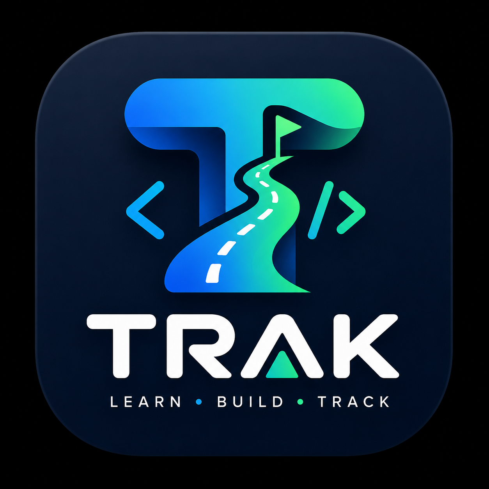

<p align="center">
  
</p>

<h1 align="center">Trak</h1>

<p align="center">
  <strong>The Local-First Developer Learning Workspace Generator</strong>
</p>

<p align="center">
  <a href="https://golang.org"></a>
  <a href="https://github.com/ndk123-web/trak-registry"></a>
  <a href="https://github.com/ndk123-web/trak/releases"></a>
  <a href="LICENSE"></a>
</p>

---

## ⚡ Overview

**Trak** is a high-performance, local-first developer CLI tool that resolves structured curriculum blueprints from the remote registry and materializes comprehensive, multi-module learning environments directly on your filesystem.

Stop copying fragmented tutorials. With a single command, Trak generates complete hands-on laboratories with working source code, build configs (`Dockerfile`, `docker-compose.yml`, `Cargo.toml`, `go.mod`), and structured cheatsheet READMEs.

---

## 🎬 Demo (v1.0.0)

<p align="center">
  <video src="https://github.com/user-attachments/assets/4210baaf-ef0d-469b-9a8a-f0e244d9b9a3" controls="controls" width="100%" style="max-width: 900px; border-radius: 12px;"></video>
</p>

https://github.com/user-attachments/assets/4210baaf-ef0d-469b-9a8a-f0e244d9b9a3

---

## 🚀 Installation

### 🪟 Windows (PowerShell 1-Liner)
```powershell
irm https://raw.githubusercontent.com/ndk123-web/trak/main/scripts/install.ps1 | iex
```

### 💻 Windows (Command Prompt / CMD 1-Liner)
```cmd
powershell -ExecutionPolicy Bypass -Command "iwr -useb https://raw.githubusercontent.com/ndk123-web/trak/main/scripts/install.ps1 | iex"
```

### 🐧 🍎 Linux & macOS (Bash 1-Liner)
```bash
curl -fsSL https://raw.githubusercontent.com/ndk123-web/trak/main/scripts/install.sh | bash
```

### 🐹 Using Go (Go 1.22+)
```bash
go install github.com/ndk123-web/trak@latest
```

### 🛠️ Build from Source
```bash
git clone https://github.com/ndk123-web/trak.git
cd trak
go build -o trak main.go
```

---

## 💻 Quick Start

### 1. Discover Learning Catalog
Browse 19 comprehensive blueprints across 5 categories in a formatted ASCII tree:
```bash
# View full catalog tree
trak list

# Or filter by category
trak list lang
trak list os
trak list cloud
trak list db
trak list tool
```

### 2. Initialize a Workspace
Materialize a complete hands-on workspace in your current directory:
```bash
# Default creates ./learn-go in current directory
trak init lang/go

# Or specify a custom destination path
trak init db/postgres --path ./my-postgres-lab
trak init tool/docker -p D:/devops/docker
```

### 3. Open and Start Learning
```bash
cd ./learn-go
code .
```

---

## 📚 19 Production Blueprints (350+ Modules)

| Category | Available Tracks | Modules | Key Topics Covered |
| :--- | :--- | :--- | :--- |
| **📦 `lang/`** | `go`, `rust`, `python`, `typescript`, `javascript`, `cpp`, `c`, `java` | 17–24 ea | Concurrency, Goroutines, Tokio Async, CPython GIL, Vtables, Strict Types, Zod |
| **🐧 `os/`** | `linux`, `windows`, `macos` | 18–19 ea | Kernel Space, Systemd, FHS, NTFS DACLs, PowerShell Pipeline, Darwin XNU, APFS |
| **☁️ `cloud/`** | `aws` | 18 | IAM Zero-Trust, VPC Networking, EC2/ALB, S3 Tiers, Aurora, Lambda, FinOps |
| **🗄️ `db/`** | `postgres`, `redis`, `sql` | 18–19 ea | MVCC Internals, GIN/BRIN Indexes, Event Loop, Streams, Sentinel HA, 3NF Schemas |
| **🛠️ `tool/`** | `docker`, `k8s`, `terraform`, `git`, `jenkins`, `ansible` | 18–19 ea | Namespaces, cgroups, CKA/CKAD Syllabus, HCL Modules, Reflog, Pipelines, Vault |

---

## 🏗️ Architecture

```text
User Command:  trak init lang/go
                     │
                     ▼
          ┌─────────────────────┐
          │   Registry Client   │ ──▶ Queries raw JSON blueprint from GitHub
          └──────────┬──────────┘
                     │
              Template Valid?
                     │
                     ▼
          ┌─────────────────────┐
          │  Filesystem Engine  │ ──▶ Recursively creates directories & files
          └──────────┬──────────┘
                     │
                     ▼
          ┌─────────────────────┐
          │  Metadata Stamping  │ ──▶ Writes immutable trak.json locally
          └─────────────────────┘
```

---

## 📁 Stamped Workspace Structure

Every materialized workspace includes working code, module directories, and a `trak.json` manifest:

```text
learn-go/
├── go.mod
├── README.md
├── trak.json                           # Immutable metadata manifest
├── 00-setup-and-toolchain/
│   ├── main.go
│   └── README.md
├── 10-goroutines-and-scheduler/
│   ├── main.go
│   └── README.md
├── 11-channels-and-communication/
│   ├── main.go
│   └── README.md
└── 19-interview-questions/
    ├── main.go
    └── README.md
```

---

## 🛠️ CLI Commands Reference

- `trak` - Welcome banner, quick start, and subcommands summary
- `trak list [category]` - Interactive tree view of all available templates
- `trak init <category>/<template> [--path <dir>]` - Materializes the hands-on workspace
- `trak version` - Displays version, build timestamp, Go runtime, and registry details
- `trak --help` - Full command manual with copy-pasteable examples

---

## 🤝 Contributing

Templates are hosted openly at [trak-registry](https://github.com/ndk123-web/trak-registry). Anyone can submit new tracks, languages, and tools via Pull Request!

---

## 📄 License

MIT License. Copyright (c) 2026 Navnath Kadam.