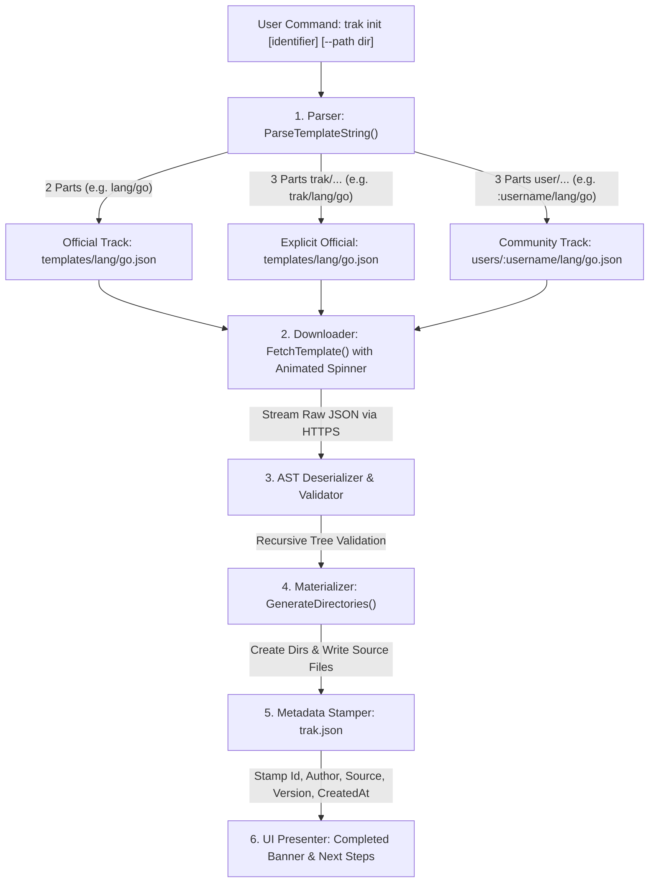

<p align="center">
  
</p>

<h1 align="center">Trak CLI</h1>

<p align="center">
  <strong>High-Performance, Local-First Developer Learning Workspace Generator</strong>
</p>

<p align="center">
  <a href="https://golang.org"></a>
  <a href="https://github.com/ndk123-web/trak-registry"></a>
  <a href="https://github.com/ndk123-web/trak/releases/tag/v1.3.0"></a>
  <a href="LICENSE"></a>
</p>

---

## ⚡ Overview

**Trak** is a high-performance, local-first developer CLI tool that resolves structured curriculum blueprints from a decoupled GitOps registry and materializes production-grade, multi-module learning laboratories directly onto your local filesystem.

Instead of copying fragmented tutorials or being trapped in browser sandboxes, Trak gives you real source code files, build manifests (`go.mod`, `Cargo.toml`, `Dockerfile`, `docker-compose.yml`), exercises, and architectural READMEs that run locally with your own tools (VS Code, GoLand, Neovim, native compilers).

---

## 🎬 Demo

<p align="center">
  <video src="https://github.com/user-attachments/assets/9156fea7-4da7-4431-9039-4db4a1ed0b4a" controls="controls" width="100%" style="max-width: 900px; border-radius: 12px;"></video>
</p>

---

## 🏗️ How Trak CLI Works (Internal Architecture)

When you invoke `trak init`, the CLI executes a deterministic 6-phase pipeline without requiring background daemons, databases, or local container runtimes:



### Detailed Pipeline Breakdown:

1. **Identifier Resolution (`internal/helper/parsestring.go`)**:
   - Parses the input string into a structured `ParsedTemplate` model (`Author`, `Category`, `ToolName`, `SourcePath`, `IsOfficial`).
   - Supports 2-part official identifiers (`lang/go`), 3-part explicit official (`trak/lang/go` or `templates/lang/go`), and 3-part community creator blueprints (`<username>/<category>/<tool>`).

2. **Decoupled Blueprint Streaming (`internal/helper/fetchtemplate.go`)**:
   - Queries the GitHub Raw Content endpoint (`https://raw.githubusercontent.com/ndk123-web/trak-registry/main/<SourcePath>`).
   - Streams and validates the payload with an interactive ANSI spinner UI.

3. **AST Workspace Materialization (`internal/generator/generatedirectories.go`)**:
   - Recursively traverses the blueprint's `Root` AST node.
   - Creates directories with standard permissions (`0755`) and writes source files (`0644`).

4. **Deterministic Provenance Stamping**:
   - Writes an immutable manifest `trak.json` in the root of the materialized workspace recording the exact creator, version tag, source path, and UTC creation timestamp:
   ```json
   {
     "id": "<username>/lang/go",
     "name": "Go (Golang) Comprehensive Mastery Track",
     "version": "1.3.0",
     "author": "<username>",
     "source": "users/<username>/lang/go.json",
     "repository": "https://github.com/ndk123-web/trak-registry",
     "created_at": "2026-09-05T10:30:00Z"
   }
   ```

---

## 🚀 Installation

### 🪟 Windows (PowerShell 1-Liner)
```powershell
irm https://raw.githubusercontent.com/ndk123-web/trak/main/scripts/install.ps1 | iex
```

### 💻 Windows (Command Prompt / CMD 1-Liner)
```cmd
powershell -ExecutionPolicy Bypass -Command "iwr -useb https://raw.githubusercontent.com/ndk123-web/trak/main/scripts/install.ps1 | iex"
```

### 🐧 🍎 Linux & macOS (Bash / Zsh 1-Liner)
```bash
curl -fsSL https://raw.githubusercontent.com/ndk123-web/trak/main/scripts/install.sh | bash
```

### 🐹 Go Install (Go 1.22+)
```bash
go install github.com/ndk123-web/trak@v1.3.0
```

---

## 💻 Commands Reference

### 1. `trak init` — Workspace Materializer
Scaffolds a complete multi-module learning lab onto your disk.

```bash
# Official tracks (Short & Explicit syntax)
trak init lang/go
trak init trak/lang/rust

# Community Creator tracks
trak init <username>/lang/go
trak init <username>/db/postgres

# Custom destination folder
trak init lang/go --path ./my-go-lab
trak init tool/docker -p D:/devops/docker-lab
```

---

### 2. `trak verify` — Automated Native Test Runner & Progress Engine
Runs native compiler and test suites against your local exercise code. When all tests pass, Trak automatically marks the module complete in `trak.json` and advances your curriculum progress.

```bash
# Verify the current pending module automatically
trak verify

# Smart prefix matching (no need to type full folder name)
trak verify 00
trak verify 01
trak verify 2

# Keyword match
trak verify escape

# Verify all modules across the entire curriculum
trak verify --all
trak verify -a

# List all supported language runtimes & verification commands
trak verify --list
trak verify allowlists
```

#### How Smart Matching Works:
For `trak verify`, `trak done`, and `trak undo`, typing the full directory name is **not mandatory**:
- Passing `00` or `0` will automatically match `00-setup-toolchain-and-first-program`.
- Passing `01` or `1` will match `01-variables-and-memory`.
- Passing keywords like `escape` will match `02-escape-analysis`.

#### Supported Runtimes & Verification Harnesses:
| Language | Toolchain | Verification Command Executed |
| :--- | :--- | :--- |
| **Go** | `go` | `go test -v ./...` |
| **Rust** | `cargo` | `cargo test` |
| **Python** | `python` / `python3` | `python -m unittest discover` |
| **TypeScript** | `npm` / `npx` | `npm test` or `npx tsx exercise_test.ts` |
| **JavaScript** | `node` | `node exercise_test.js` |
| **C** | `gcc` / `clang` / `cl` | `gcc exercise_test.c -o test && ./test` |
| **C++** | `g++` / `clang++` | `g++ -std=c++17 exercise_test.cpp -o test && ./test` |

---

### 3. `trak list` — Interactive Catalog Explorer
Displays all curated tracks across 5 categories in a formatted tree:

```bash
# View complete master tree
trak list

# Filter by category
trak list lang     # Programming Languages
trak list os       # Operating Systems
trak list cloud    # Cloud Platforms
trak list db       # Databases & Storage
trak list tool     # DevOps & Tools
```

---

### 4. `trak next` — Discover Next Pending Exercise
Inspects `trak.json`, resolves the next incomplete module sequentially, and gives you direct navigation links:

```bash
# View next module details and starter command
trak next

# Automatically launch module in VS Code
trak next --open
trak next -o
```

---

### 5. `trak status` — Interactive Progress & State Dashboard
Inspects the current workspace for `trak.json`, calculates module completion metrics, and renders a visual progress dashboard:

```bash
trak status
```

---

### 6. `trak done` — Mark Curriculum Module Complete
Manually marks a module as completed in `trak.json`, updates your progress percentage, and guides you to the next exercise:

```bash
# Smart matching by number prefix (full name not required)
trak done 00
trak done 1

# By folder name or keyword
trak done 01-runtime-and-escape-analysis
trak complete 02
trak mark 03
```

---

### 7. `trak undo` — Reset Module Back to Pending
Reverts a completed module back to pending if you want to redo or revise exercises:

```bash
# Smart matching by number prefix
trak undo 01
trak reset 01
trak unmark 02
```

---

### 8. `trak version` — Version & System Metadata
Prints detailed information about your installed binary:

```bash
trak version
```
```text
  ⚡ Trak CLI (v1.3.0)
  ──────────────────────────────────────────────
  • Version     :  v1.3.0
  • Build       :  2026.09
  • Go Runtime  :  go1.22.5
  • Platform    :  windows/amd64
  • Registry    :  github.com/ndk123-web/trak-registry (main)
```

---

## 📦 Multi-Architecture Distribution Builder

Trak includes a standalone cross-compilation pipeline script ([`scripts/build-dist.ps1`](scripts/build-dist.ps1)) that builds optimized, stripped production binaries across 8 target platforms:

```powershell
# Run from repository root
.\scripts\build-dist.ps1 -Version "1.3.0"
```

### Generated Release Artifacts (`dist/v1.3.0/`):
- `trak_1.3.0_windows_amd64.zip` (Windows 64-bit)
- `trak_1.3.0_windows_arm64.zip` (Windows ARM64)
- `trak_1.3.0_windows_386.zip` (Windows 32-bit)
- `trak_1.3.0_darwin_arm64.tar.gz` (macOS Apple Silicon M1/M2/M3/M4)
- `trak_1.3.0_darwin_amd64.tar.gz` (macOS Intel)
- `trak_1.3.0_linux_amd64.tar.gz` (Linux x86_64)
- `trak_1.3.0_linux_arm64.tar.gz` (Linux ARM64 / aarch64)
- `trak_1.3.0_linux_386.tar.gz` (Linux 32-bit)
- `checksums.txt` (SHA-256 cryptographic hashes)

---

## 🗂️ Codebase Architecture

```text
trak-cli/
├── cmd/                          # Cobra CLI command definitions
│   ├── root.go                   # Root command & interactive banner
│   ├── init.go                   # 'trak init' command & flag handling
│   ├── verify.go                 # 'trak verify' test harness runner
│   ├── list.go                   # 'trak list' formatted catalog tree
│   ├── next.go                   # 'trak next' sequential module resolver
│   ├── status.go                 # 'trak status' visual progress dashboard
│   ├── done.go                   # 'trak done' manual completion marker
│   ├── undo.go                   # 'trak undo' module status resetter
│   ├── allowedlists.go           # Supported languages runtime reference
│   └── version.go                # 'trak version' diagnostic display
├── internal/
│   ├── config/                   # Global configuration & registry endpoints
│   ├── generator/                # Recursive filesystem materialization engine
│   ├── helper/                   # Parser (parsestring.go) & Downloader (fetchtemplate.go)
│   ├── models/                   # AST Node & Workspace manifest structs
│   ├── shared/                   # Toolchain resolution & runtime test runners (runtimes.go)
│   └── ui/                       # ANSI terminal formatters, spinners, and banners
├── scripts/
│   ├── build-dist.ps1            # Multi-architecture distribution compiler
│   ├── install.ps1               # Windows PowerShell installer
│   ├── install.cmd               # Windows CMD installer
│   └── install.sh                # Linux/macOS curl installer
├── go.mod
└── main.go                       # Application entry point
```

---

## 🤝 Contributing

We welcome community contributions! You can publish your own custom learning tracks to the global ecosystem without touching this CLI repository. See the [Trak Registry Guide](https://github.com/ndk123-web/trak-registry) for the 100% GitOps contribution workflow.

---

## 📄 License

MIT License. Copyright (c) 2026 Navnath Kadam.